

  <a href="https://aimran.es"></a>

  


 


  <a href="https://usesahl.com"></a>
  <a href="https://tools.aimran.es"></a>
  <a href="https://library.aimran.es"></a>
  <a href="https://mascotasegura360.es"></a>

 


 


 

  <a href="https://aimran.es"></a>

